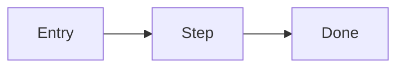

# User Flows
One section per flow. Each flow is reused as an E2E test in `.ai/mcp_and_qa/E2E_FLOWS.md`.
## Flow F1: _name_
Actor · Entry · Steps (1…n) · Success state · Failure/edge states

```mermaid
flowchart LR
  A[Entry] --> B[Step] --> C[Done]
```
